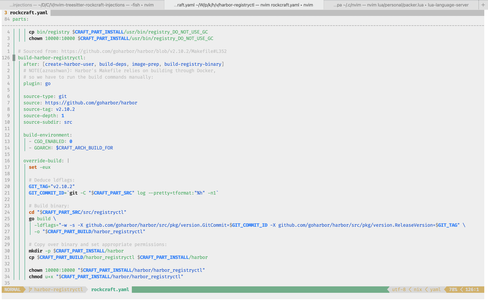

# nvim-treesitter-rockcraft-injections

[Treesitter](https://github.com/nvim-treesitter/nvim-treesitter)
injections for [`rockcraft.yaml` files](https://github.com/canonical/rockcraft).

### Features:

Inject bash syntax highlighting for the various script fields in
[`rockcraft`](https://github.com/canonical/rockcraft) YAML specs as
[defined here](https://documentation.ubuntu.com/rockcraft/en/latest/reference/rockcraft.yaml/),
namely:
* `overlay-script`
* `override-pull`
* `override-build`
* `override-stage`
* `override-prime`

### Installation:

NOTE: **ensure you have
[`nvim-treesitter`](https://github.com/nvim-treesitter/nvim-treesitter)
already installed**

Depending on your package manager, add  the following to your config:

* [Vundle](https://github.com/VundleVim/Vundle.vim): `Plugin 'aznashwan/nvim-treesitter-rockcraft-injections'`
* [Vim-Plug](https://github.com/junegunn/vim-plug): `Plug 'aznashwan/nvim-treesitter-rockcraft-injections'`
* [Packer](https://github.com/wbthomason/packer.nvim): `use 'aznashwan/nvim-treesitter-rockcraft-injections'`

After adding the plugin to your package manager config, open NeoVim and run:

* [Vundle](https://github.com/VundleVim/Vundle.vim): `:PluginInstall`
* [Vim-Plug](https://github.com/junegunn/vim-plug): `:PlugInstall`
* [Packer](https://github.com/wbthomason/packer.nvim): `:PackerSync`
